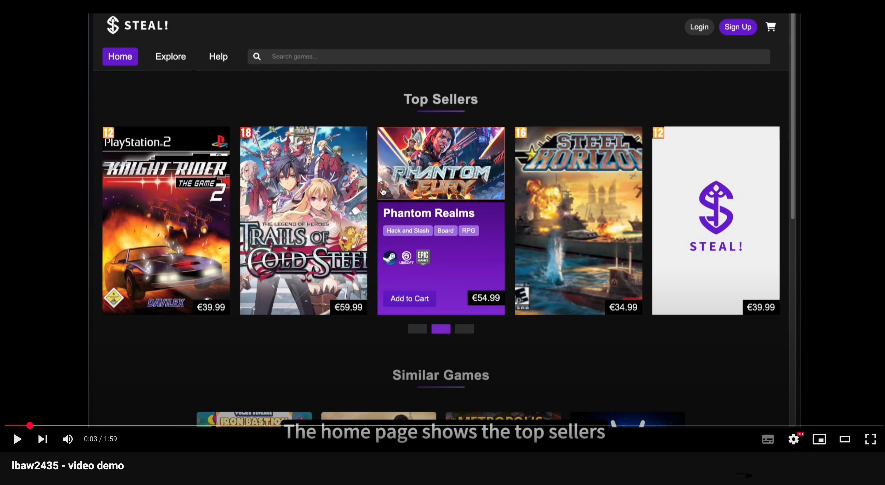

<div align="center">
    
</div>
</br>

**STEAL!** is an online marketplace focused on selling [CD Keys](https://help.steampowered.com/en/faqs/view/0E71-0971-324A-1161). It offers a secure, user-friendly platform for gamers seeking affordable game keys, aiming to become the top destination for accessible, high-quality digital gaming.

> **"SO AFFORDABLE IT'S LIKE STEALING!"** 

## Features
- 🎮 **Personalized Recommendations**: Suggests games based on past orders and top-sellers
- 🔍 **Advanced Search**: Easily find games with filters
- 🔔 **Wishlist Alerts**: Real-time notifications for sales and restocks
- 🎁 **Rewards**: Earn S-coins for discounts on future purchases.
- 💰 **Flexible Checkout**: Buy single games or entire carts with multiple payment options.

## Software dependencies
To prepare the computer, you need to install:
- [PHP](https://www.php.net/) version 8.3 or higher
- [Composer](https://getcomposer.org/) version 2.2 or higher

Recommendation: Ubuntu 22.04.5 LTS or newer that ships with these versions.

```bash
sudo apt update
sudo apt install git composer php8.3 php8.3-mbstring php8.3-xml php8.3-pgsql php8.3-curl
```

On macOS, install using [Homebrew](https://brew.sh/):
```bash
brew install php@8.3 composer
```

If you use [Windows WSL](https://learn.microsoft.com/en-us/windows/wsl/install), ensure you are using Ubuntu 24.04 inside WSL. Previous versions do not provide the required packages. After setting up WSL, follow the Ubuntu instructions above.

## Running locally (for development)

#### 1. Create own .env file and fill in variables (Google OAuth and MailTrap)
```bash
cp .env.template .env
```

#### 2. Install local PHP dependencies
```bash
composer install
```

#### 3. PostgreSQL and pgAdmin4 setup
The ***Docker Compose*** file provided sets up **PostgreSQL** and **pgAdmin4** as local Docker containers.

Start the containers from the project root:
```bash
docker compose up -d
```
Open your browser and navigate to [http://localhost:4321](http://localhost:4321) to access pgAdmin4.

In pgAdmin4, **Add New Server**:
- **Name:** postgres
- **Host name/address:** postgres
- **Port:** 5432
- **Maintenance database:** postgres
- **Username:** postgres
- **Password:** pg!password

Stop the containers when needed:
```bash
docker compose down
```

#### 4. Developing the project
```bash
# Seed database from the SQL file
# Required: first run and after database script changes
php artisan db:seed

# Start the development server
php artisan serve
```

To stop the server: Press `Ctrl-C`

The application will be available at `http://localhost:8000`

## Running the product
Login to GitLab's Container Registry (using FEUP VPN/network):

```bash
docker login gitlab.up.pt:5050
```

To start the Docker image available at GitLab Container Registry using the production database, use the following command:

```bash
docker run -d --name lbaw2435 -p 8001:80 gitlab.up.pt:5050/lbaw/lbaw2425/lbaw2435
```
For ARM users (e.g., Apple Silicon Macs) you can run the image with:

```bash
docker run --platform linux/arm64 -d --name lbaw2435 -p 8001:80 gitlab.up.pt:5050/lbaw/lbaw2425/lbaw2435
```


To stop and remove the container:

```bash
docker stop lbaw2435
docker rm lbaw2435
```

The application will be available at `http://localhost:8001`

## Usage

#### Administration Credentials

| Username | Email | Password |
| -------- | -------- | -------- |
| admin    | admin@example.com | 1234

#### User Credentials

| Type | Username | Email | Password |
| -------- | --------- | -------- | -------- |
| Buyer Account | buyer1 | buyer1@example.com | 1234 |
| Seller Account | seller1 | seller1@example.com | 1234 |

## Product Video



Video Available at https://youtu.be/bTJrHXjnlQc

## Contributors

GROUP2435, LBAW 2024/2025

* [Bruno Huang](https://github.com/YZ1GO), up202207517@up.pt
* [Daniel Basílio](https://github.com/danielcbasilio), up201806838@up.pt
* [Francisco Magalhães](https://github.com/frankie02m2023), up202007945@up.pt
* [Ricardo Yang](https://github.com/ricardoyang00), up202208465@up.pt

### Grades
> [Requirement Specification (ER) Component](https://github.com/YZ1GO/L.EIC023_LBAW_PRJ/wiki/ER): 95%<br>
> [Database Specification (EBD) Component](https://github.com/YZ1GO/L.EIC023_LBAW_PRJ/wiki/EBD): 89%<br>
> [Architecture Specication and Prototype (EAP) Component](https://github.com/YZ1GO/L.EIC023_LBAW_PRJ/wiki/EAP): 93%<br>
> [Product and Presentation (PA) Component](https://github.com/YZ1GO/L.EIC023_LBAW_PRJ/wiki/PA):  92%<br>
> Final Grade: 18.4/20.0 

