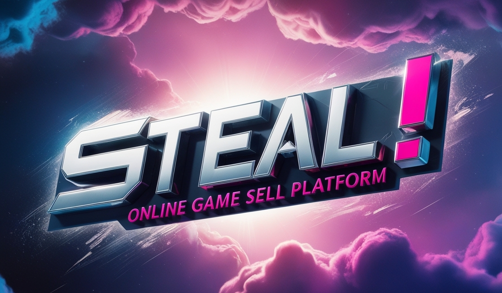

# ER: Requirements Specification Component

**Project Vision**

    

**STEAL!** is an online marketplace focused on selling Content Distribution Keys (CDKs). It offers a secure, user-friendly platform for gamers seeking affordable game keys, aiming to become the top destination for accessible and quality digital gaming.

**"SO AFFORDABLE IT'S LIKE STEALING!"** 

----

## A1: Project Name

**Goals, Business Context, and Environment**

The STEAL! aims to be a website where gamers can buy CDKs , which can be activated in game platforms like Steam, Uplay, and Origin. Competing with other online gaming stores, STEAL! focuses on providing a smooth user experience, competitive prices, and a wide range of games for both casual and dedicated gamers.

**Motivation**

The increase in demand for video games has made STEAL! possible by providing affordable game keys in an easy and safe way, attracting a wide range of gamers.

**Main Features**

STEAL! provides advanced search and filtering options, making it easy for users to find their desired games. It also offers personalized game recommendations based on users' preferences for those unsure of what to play next. Recognizing that our users are the foundation of our success, we reward them with S coins, which can be used in the shop. Additionally, users can create wishlists to save their favorite games and take advantage of special sales when they occur.

**User Profiles** (? not completed yet)

NAME accommodates four distinct user profiles. *Anonymous Users* can browse products without registration, allowing them to explore the marketplace before deciding to create an account. *Buyers* are registered users who can browse products, purchase CDKs, and engage with the platform through wishlists and reviews. *Administrators* have full control over the platform, managing product listings, user accounts, and overseeing order processing to ensure smooth operations; however, they cannot make purchases. *Sellers* are users who list CDKs for sale and manage their product information and pricing, but they also cannot buy products on the platform. Together, these user profiles create a dynamic marketplace that fosters interaction and supports the gaming community.

---

## A2: Actors and User stories

The following artifact contains the specifications about the actors and their user stories, acting as a guide and simple documentation for these project's requirements.

### 1. Actors

**Figure 1:** Actor Diagram

| **Actor**            | **Description**                                                                                     |
|----------------------|-----------------------------------------------------------------------------------------------------|
| Anonymous User        | Users who can browse products without registration, allowing them to explore the marketplace, but can choose to authenticate when they wish so.        |
| User                 | Generic user that can access al publicly available information such as listed CDKs.                                      |
| Authenticated User   | Registered users with access to additional features of the platform.                                 |
| Buyer                | Registered users who can browse products, purchase CDKs, and create wishlists and engage with reviews.      |
| Seller               | Users who list CDKs for sale and manage their product information and pricing. Cannot buy products.  |
| Administrator        | Users with full control over the platform, managing product listings, user accounts, and overseeing order processing. Cannot make purchases. |

**Table 1:** Actors and their descriptions

### 2. User Stories

> User stories organized by actor.  
> For each actor, a table containing a line for each user story, and for each user story: an identifier, a name, a priority, and a description (following the recommended pattern).

#### 2.1. Actor 1

#### 2.2. Actor 2

#### 2.N. Actor n

### 3. Supplementary Requirements

> Section including business rules, technical requirements, and restrictions.  
> For each subsection, a table containing identifiers, names, and descriptions for each requirement.

#### 3.1. Business rules

#### 3.2. Technical requirements

#### 3.3. Restrictions

---

## A3: Information Architecture

> Brief presentation of the artifact goals.

### 1. Sitemap

> Sitemap presenting the overall structure of the web application.  
> Each page must be identified in the sitemap.  
> Multiple instances of the same page (e.g. student profile in SIGARRA) are presented as page stacks.

### 2. Wireframes

> Wireframes for, at least, two main pages of the web application.
> Do not include trivial use cases (e.g. about page, contacts).

#### UIxx: Page Name

#### UIxx: Page Name

---

## Revision history

Changes made to the first submission:
1. Item 1
1. ...

***
GROUPYYgg, DD/MM/20YY

* Group member 1 name, email (Editor)
* Group member 2 name, email
* ...