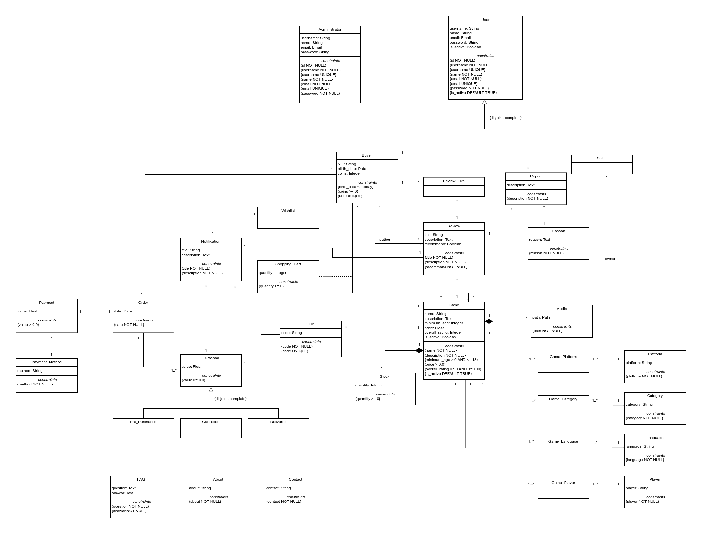

# EBD: Database Specification Component

**Project Vision**

**STEAL!** is an online marketplace focused on selling Content Distribution Keys (CDKs). It offers a secure, user-friendly platform for gamers seeking affordable game keys, aiming to become the top destination for accessible, high-quality digital gaming.

> **"SO AFFORDABLE IT'S LIKE STEALING!"** 

----

## A4: Conceptual Data Model

The goal of the class diagram for STEAL! is to visually represent the core components and structure of the platform, defining the key entities, attributes, and behaviors necessary to manage the buying, selling, and distribution of game CDKs.

### 1. Class diagram

> The following artifact is a UML class diagram representing the conceptual model of the STEAL! platform.

**Figure 1:** STEAL! conceptual data model in UML.

### 2. Additional Business Rules
 
- BR01 A seller is unable to purchase games on the platform.
- BR02 A buyer is unable to purchase games that have a higher age rating than their own.

---

## A5: Relational Schema, validation and schema refinement

> This artifact outlines the STEAL! platform's relational schema, detailing key relations, attributes, data types, and integrity constraints to ensure data consistency and accuracy in the database design.

### 1. Relational Schema

> The Relational Schema specifies the relations, attributes, domains, and integrity constraints like UNIQUE, DEFAULT, NOT NULL, and CHECK. Each relation is represented in a compact notation for easy reference. 

| Relation reference | Relation Compact Notation                        |
| ------------------ | ------------------------------------------------ |
| R01                | administrator(<ins>id</ins>, username **UK** **NN**, name **NN**, email **UK** **NN**, password **NN**) |
| R02                | user(<ins>id</ins>, username **UK** **NN**, name **NN**, email **UK** **NN**, password **NN**) |
| R03                | buyer(<ins>id_user</ins> -> user **NN**, NIF **UK**, birth_date **NN** **CK** birth_date <= Today, coins **NN** **CK** coins >= 0) |
| R04                | seller(<ins>id_user</ins> -> user **NN**) |
| R05                | wishlist(<ins>id</ins>, <ins>id_buyer</ins> → buyer **NN**, <ins>id_game</ins> -> game **NN**) |
| R06                | shopping_cart(<ins>id</ins>, <ins>id_buyer</ins> → buyer **NN**, <ins>id_game</ins> -> game **NN**, quantity **NN** **CK** quantity >= 0) |
| R07                | order(<ins>id</ins>, <ins>id_buyer</ins> -> buyer **NN**, date **NN**) |
| R08                | payment(<ins>id</ins>, value **NN** **CK** value > 0.0) |
| R09                | payment_method(<ins>id</ins>, method **NN**) |
| R10                | notification(<ins>id</ins>, title **NN**, description **NN**) |
| R11                | review(<ins>id</ins>, title **NN**, description **NN**, recommend **NN**, id_author -> buyer **NN**, id_game **NN**) |
| R12                | review_like(<ins>id</ins>, id_review -> review **NN**, id_author -> buyer **NN**) |
| R13                | report(<ins>id</ins>, description **NN**, id_reason -> reason **NN**) |
| R14                | reason(<ins>id</ins>, reason **NN**) |
| R15                | game(<ins>id</ins>, name **NN**, description **NN**, minimum_age **NN** **CK** minimum_age > 0, price **NN** **CK** price > 0.0, id_owner -> seller **NN**, id_platform -> platform **NN**, id_category -> category **NN**, id_language -> language **NN**, id_player -> player **NN**) |
| R16                | cdk(<ins>id</ins>, code **UK** **NN**, id_game -> game **NN**) |
| R17                | stock<ins>id</ins>, quantity **NN** **CK** quantity >= 0, <ins>id_game</ins> -> game **NN** |
| R18                | platform(<ins>id</ins>, platform **NN**) |
| R19                | category(<ins>id</ins>, category **NN**) |
| R20                | language(<ins>id</ins>, language **NN**) |
| R21                | player(<ins>id</ins>, player **NN**) |
| R22                | media(<ins>id</ins>, path **NN**, <ins>id_game</ins> -> game **NN**) |
| R23                | purchase(<ins>id</ins>, value **NN** **CK** value > 0.0, status **NN** **CK** status **IN** Status) |
| R24                | faq(<ins>id</ins>, question **NN**, answer **NN**) |
| R25                | about(<ins>id</ins>, about **NN**) |
| R26                | contact(<ins>id</ins>, contact **NN**) |

Legend: 
- UK = UNIQUE KEY
- NN = NOT NULL
- CK = CHECK

### 2. Domains

> Specification of additional domains:  

| Domain Name | Domain Specification           |
| ----------- | ------------------------------ |
| Today	      | DATE DEFAULT CURRENT_DATE      |
| Status      | ENUM ('Pre_Purchased', 'Cancelled', 'Delivered') |

### 3. Schema validation

> To validate the Relational Schema obtained from the Conceptual Model, all functional dependencies are identified and the normalization of all relation schemas is accomplished. Should it be necessary, in case the scheme is not in the Boyce–Codd Normal Form (BCNF), the relational schema is refined using normalization.  

| **TABLE R01** | administrator |
| - | - |
| **Keys** | { id }, { username }, { email } |
| **Functional Dependencies:** | |
| FD0101 | id → {username, name, email, password} |
| FD0102 | username → {id, name, email, password} |
| FD0103 | email → {id, username, name, password} |
| **NORMAL FORM** | BCNF |

| **TABLE R02** | user |
| - | - |
| **Keys** | { id }, { username }, { email } |
| **Functional Dependencies:** | |
| FD0201 | id → {username, name, email, password} |
| FD0202 | username → {id, name, email, password} |
| FD0203 | email → {id, username, name, password} |
| **NORMAL FORM** | BCNF |

| **TABLE R03** | buyer |
| - | - |
| **Keys** | { id_user }, { NIF } |
| **Functional Dependencies:** | |
| FD0301 | id_user → {NIF, birth_date, coins} |
| FD0302 | NIF → {id_user, birth_date, coins} |
| **NORMAL FORM** | BCNF |

| **TABLE R04** | seller |
| - | - |
| **Keys** | { id_user } |
| **Functional Dependencies:** | *none* |
| **NORMAL FORM** | BCNF |

| **TABLE R05** | wishlist |
| - | - |
| **Keys** | { id }, { id_buyer } |
| **Functional Dependencies:** | |
| FD0501 | id → {id_buyer} |
| FD0502 | id_buyer → {id} |
| **NORMAL FORM** | BCNF |

| **TABLE R06** | shopping_cart |
| - | - |
| **Keys** | { id }, { id_buyer } |
| **Functional Dependencies:** | |
| FD0601 | id → {id_buyer} |
| FD0602 | id_buyer → {id} |
| **NORMAL FORM** | BCNF |

| **TABLE R07** | order |
| - | - |
| **Keys** | { id } |
| **Functional Dependencies:** | |
| FD0701 | id → {id_buyer, date} |
| **NORMAL FORM** | BCNF |

| **TABLE R08** | payment |
| - | - |
| **Keys** | { id } |
| **Functional Dependencies:** | |
| FD0801 | id → {value} |
| **NORMAL FORM** | BCNF |

| **TABLE R09** | payment_method |
| - | - |
| **Keys** | { id } |
| **Functional Dependencies:** | |
| FD0901 | id → {method} |
| **NORMAL FORM** | BCNF |

| **TABLE R10** | notification |
| - | - |
| **Keys** | { id } |
| **Functional Dependencies:** | |
| FD1001 | id → {title, description} |
| **NORMAL FORM** | BCNF |

| **TABLE R11** | review |
| - | - |
| **Keys** | { id } |
| **Functional Dependencies:** | |
| FD1101 | id → {title, description, recommend, id_author, id_game} |
| **NORMAL FORM** | BCNF |

| **TABLE R12** | review_like |
| - | - |
| **Keys** | { id } |
| **Functional Dependencies:** | |
| FD1201 | id → {id_review, id_author} |
| **NORMAL FORM** | BCNF |

| **TABLE R13** | report |
| - | - |
| **Keys** | { id } |
| **Functional Dependencies:** | |
| FD1301 | id → {description, id_reason} |
| **NORMAL FORM** | BCNF |

| **TABLE R14** | reason |
| - | - |
| **Keys** | { id } |
| **Functional Dependencies:** | |
| FD1401 | id → {reason} |
| **NORMAL FORM** | BCNF |

| **TABLE R15** | game |
| - | - |
| **Keys** | { id } |
| **Functional Dependencies:** | |
| FD1501 | id → {name, description, minimum_age, price, id_owner, id_platform, id_category, id_language, id_player} |
| **NORMAL FORM** | BCNF |

| **TABLE R16** | cdk |
| - | - |
| **Keys** | { id }, { code } |
| **Functional Dependencies:** | |
| FD1601 | id → {code, id_game} |
| FD1602 | code → {id, id_game} |
| **NORMAL FORM** | BCNF |

| **TABLE R17** | stock |
| - | - |
| **Keys** | { id }, { id_game } |
| **Functional Dependencies:** | |
| FD1701 | id → {quantity, id_game} |
| FD1702 | id_game → {id, quantity} |
| **NORMAL FORM** | BCNF |

| **TABLE R18** | platform |
| - | - |
| **Keys** | { id } |
| **Functional Dependencies:** | |
| FD1801 | id → {platform} |
| **NORMAL FORM** | BCNF |

| **TABLE R19** | category |
| - | - |
| **Keys** | { id } |
| **Functional Dependencies:** | |
| FD1901 | id → {category} |
| **NORMAL FORM** | BCNF |

| **TABLE R20** | language |
| - | - |
| **Keys** | { id } |
| **Functional Dependencies:** | |
| FD2001 | id → {language} |
| **NORMAL FORM** | BCNF |

| **TABLE R21** | player |
| - | - |
| **Keys** | { id } |
| **Functional Dependencies:** | |
| FD2101 | id → {player} |
| **NORMAL FORM** | BCNF |

| **TABLE R22** | media |
| - | - |
| **Keys** | { id }, { id_game } |
| **Functional Dependencies:** | |
| FD2201 | id → {path, id_game} |
| FD2202 | id_game → {id, path} |
| **NORMAL FORM** | BCNF |

| **TABLE R23** | purchase |
| - | - |
| **Keys** | { id } |
| **Functional Dependencies:** | |
| FD2301 | id → {value, status} |
| **NORMAL FORM** | BCNF |

| **TABLE R24** | faq |
| - | - |
| **Keys** | { id } |
| **Functional Dependencies:** | |
| FD2401 | id → {question, answer} |
| **NORMAL FORM** | BCNF |

| **TABLE R25** | about |
| - | - |
| **Keys** | { id } |
| **Functional Dependencies:** | |
| FD2501 | id → {about} |
| **NORMAL FORM** | BCNF |

| **TABLE R26** | contact |
| - | - |
| **Keys** | { id } |
| **Functional Dependencies:** | |
| FD2601 | id → {contact} |
| **NORMAL FORM** | BCNF |

> If necessary, description of the changes necessary to convert the schema to BCNF.  
> Justification of the BCNF.  

---

## A6: Indexes, triggers, transactions and database population

> Brief presentation of the artifact goals.

### 1. Database Workload
 
> A study of the predicted system load (database load).
> Estimate of tuples at each relation.

| **Relation reference** | **Relation Name** | **Order of magnitude**        | **Estimated growth** |
| ------------------ | ------------- | ------------------------- | -------- |
| R01                | Table1        | units|dozens|hundreds|etc | order per time |
| R02                | Table2        | units|dozens|hundreds|etc | dozens per month |
| R03                | Table3        | units|dozens|hundreds|etc | hundreds per day |
| R04                | Table4        | units|dozens|hundreds|etc | no growth |

### 2. Proposed Indices

#### 2.1. Performance Indices
 
> Indices proposed to improve performance of the identified queries.

| **Index**           | IDX01                                  |
| ---                 | ---                                    |
| **Relation**        | Relation where the index is applied    |
| **Attribute**       | Attribute where the index is applied   |
| **Type**            | B-tree, Hash, GiST or GIN              |
| **Cardinality**     | Attribute cardinality: low/medium/high |
| **Clustering**      | Clustering of the index                |
| **Justification**   | Justification for the proposed index   |
| `SQL code`                                                  ||

#### 2.2. Full-text Search Indices 

> The system being developed must provide full-text search features supported by PostgreSQL. Thus, it is necessary to specify the fields where full-text search will be available and the associated setup, namely all necessary configurations, indexes definitions and other relevant details.  

| **Index**           | IDX01                                  |
| ---                 | ---                                    |
| **Relation**        | Relation where the index is applied    |
| **Attribute**       | Attribute where the index is applied   |
| **Type**            | B-tree, Hash, GiST or GIN              |
| **Clustering**      | Clustering of the index                |
| **Justification**   | Justification for the proposed index   |
| `SQL code`                                                  ||

### 3. Triggers
 
> User-defined functions and trigger procedures that add control structures to the SQL language or perform complex computations, are identified and described to be trusted by the database server. Every kind of function (SQL functions, Stored procedures, Trigger procedures) can take base types, composite types, or combinations of these as arguments (parameters). In addition, every kind of function can return a base type or a composite type. Functions can also be defined to return sets of base or composite values.  

| **Trigger**      | TRIGGER01                              |
| ---              | ---                                    |
| **Description**  | Trigger description, including reference to the business rules involved |
| `SQL code`                                             ||

### 4. Transactions
 
> Transactions needed to assure the integrity of the data.  

| SQL Reference   | Transaction Name                    |
| --------------- | ----------------------------------- |
| Justification   | Justification for the transaction.  |
| Isolation level | Isolation level of the transaction. |
| `Complete SQL Code`                                   ||

## Annex A. SQL Code

> The database scripts are included in this annex to the EBD component.
> 
> The database creation script and the population script should be presented as separate elements.
> The creation script includes the code necessary to build (and rebuild) the database.
> The population script includes an amount of tuples suitable for testing and with plausible values for the fields of the database.
>
> The complete code of each script must be included in the group's git repository and links added here.

### A.1. Database schema

> The complete database creation must be included here and also as a script in the repository.

### A.2. Database population

> Only a sample of the database population script may be included here, e.g. the first 10 lines. The full script must be available in the repository.

---

## Revision history

Changes made to the first submission:
1. Item 1
1. ..

***
GROUPYYgg, DD/MM/20YY
 
* Group member 1 name, email (Editor)
* Group member 2 name, email
* ...