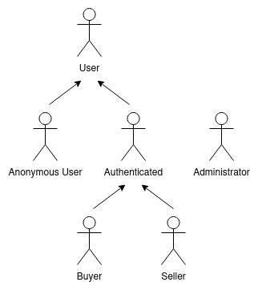

# ER: Requirements Specification Component

**Project Vision**

The vision for NAME is to establish a leading online marketplace for gamers, specifically focusing on the sale of Content Distribution Keys (CDKs). By providing a secure, efficient, and user-friendly platform, NAME aims to become the go-to destination for gamers seeking affordable game keys, fostering a community that values both accessibility and quality in digital gaming.

## A1: Project Name

**Goals, Business Context, and Environment**

The NAME project seeks to create a web-based platform for gamers to purchase CDKs for various video games. Positioned in the competitive landscape of online gaming marketplaces, NAME aims to deliver a seamless user experience, competitive pricing, and a vast selection of games, catering to both casual and dedicated gamers.

**Motivation**

The increasing demand for digital game distribution presents a significant opportunity for a dedicated platform focused on CDKs. NAME addresses this demand by offering affordable game keys while ensuring a secure and user-friendly purchasing process, appealing to a broad audience of gamers.

**Main Features**

The platform includes features such as advanced search capabilities and product filtering, enabling users to find specific games based on genre or platform. Users can create wishlists to save their favorite games and leave reviews and ratings to share their experiences with others. The shopping cart allows for easy management of purchases, and the streamlined checkout process supports multiple payment options. Additionally, users can track their purchase history and receive notifications about order status, promotions, and wishlist item availability.

**User Profiles**

NAME accommodates four distinct user profiles. *Anonymous Users* can browse products without registration, allowing them to explore the marketplace before deciding to create an account. *Buyers* are registered users who can browse products, purchase CDKs, and engage with the platform through wishlists and reviews. *Administrators* have full control over the platform, managing product listings, user accounts, and overseeing order processing to ensure smooth operations; however, they cannot make purchases. *Sellers* are users who list CDKs for sale and manage their product information and pricing, but they also cannot buy products on the platform. Together, these user profiles create a dynamic marketplace that fosters interaction and supports the gaming community.

---

## A2: Actors and User stories

The following artifact contains the specifications about the actors and their user stories, acting as a guide and simple documentation for these project's requirements.

### 1. Actors

**Figure 1:** Actor Diagram

| **Actor**            | **Description**                                                                                     |
|----------------------|-----------------------------------------------------------------------------------------------------|
| Anonymous User        | Users who can browse products without registration, allowing them to explore the marketplace, but can choose to authenticate when they wish so.        |
| User                 | Generic user that can access al publicly available information such as listed CDKs.                                      |
| Authenticated User   | Registered users with access to additional features of the platform.                                 |
| Buyer                | Registered users who can browse products, purchase CDKs, and create wishlists and engage with reviews.      |
| Seller               | Users who list CDKs for sale and manage their product information and pricing. Cannot buy products.  |
| Administrator        | Users with full control over the platform, managing product listings, user accounts, and overseeing order processing. Cannot make purchases. |

**Table 1:** Actors and their descriptions

### 2. User Stories

> User stories organized by actor.  
> For each actor, a table containing a line for each user story, and for each user story: an identifier, a name, a priority, and a description (following the recommended pattern).

#### 2.1. Actor 1

#### 2.2. Actor 2

#### 2.N. Actor n

### 3. Supplementary Requirements

> Section including business rules, technical requirements, and restrictions.  
> For each subsection, a table containing identifiers, names, and descriptions for each requirement.

#### 3.1. Business rules

#### 3.2. Technical requirements

#### 3.3. Restrictions

---

## A3: Information Architecture

> Brief presentation of the artifact goals.

### 1. Sitemap

> Sitemap presenting the overall structure of the web application.  
> Each page must be identified in the sitemap.  
> Multiple instances of the same page (e.g. student profile in SIGARRA) are presented as page stacks.

### 2. Wireframes

> Wireframes for, at least, two main pages of the web application.
> Do not include trivial use cases (e.g. about page, contacts).

#### UIxx: Page Name

#### UIxx: Page Name

---

## Revision history

Changes made to the first submission:
1. Item 1
1. ...

***
GROUPYYgg, DD/MM/20YY

* Group member 1 name, email (Editor)
* Group member 2 name, email
* ...