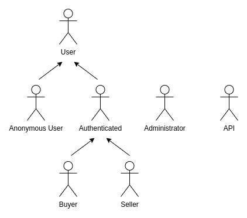

# ER: Requirements Specification Component

**Project Vision**

    

 

**STEAL!** is an online marketplace focused on selling Content Distribution Keys (CDKs). It offers a secure, user-friendly platform for gamers seeking affordable game keys, aiming to become the top destination for accessible, high-quality digital gaming.

> **"SO AFFORDABLE IT'S LIKE STEALING!"** 

----

## A1: STEAL!

### Goals, Business Context, and Environment

STEAL! aims to be a website where gamers can buy Content Distribution Keys (CDKs), which can be activated on game platforms like Steam, Uplay, and Origin. Competing with other online gaming stores, STEAL! focuses on providing a smooth user experience, competitive prices, and a wide range of games for both casual and dedicated gamers.

### Motivation

The increased demand for video games has made STEAL! possible by providing affordable game keys in an easy and safe manner, attracting a wide range of gamers.

### Main Features

STEAL! provides advanced search and filtering options, making it easy for users to find their desired games. It also offers personalized game recommendations based on users' preferences for those unsure of what to play next. 

Recognizing that our users are the foundation of our success, we reward them with **S coins**, which can be used in the store. Additionally, users can create wishlists to save their favorite games and take advantage of special sales when they occur.

### User Profiles

STEAL! accommodates four distinct user profiles: 
- **Anonymous Users:** can browse products without registration, allowing them to explore the marketplace before deciding whether to create an account. 
- **Buyers:** are registered users who can browse products, purchase CDKs, and engage with the platform through wishlists and reviews. 
- **Sellers:** are users who list CDKs for sale and manage their product information and pricing, but they cannot buy products on the platform. 
- **Administrators:** have full control over the platform, managing product listings, user accounts, and overseeing order processing to ensure smooth operations; however, they also cannot make purchases. 

Together, these user profiles create a dynamic marketplace that fosters interaction and supports the gaming community.

---

## A2: Actors and User stories

The following artifact contains the specifications about the actors and their user stories, acting as a guide and simple documentation for these project's requirements.

### 1. Actors

**Figure 1:** STEAL! actors.

| **Actor** | **Description** |
|-|-|
| Anonymous User | Users who can browse products without registration, allowing them to explore the marketplace, but can choose to authenticate whenever they wish. |
| User | Generic users who can access all publicly available information, such as listed CDKs. |
| Authenticated User | Registered users who have access to additional features of the platform. |
| Buyer | Registered users who can browse products, purchase CDKs, and create wishlists and engage with reviews. |
| Seller | Users who list CDKs for sale and manage their product information and pricing. Cannot buy products. |
| Administrator | Users with full control over the platform, managing product listings, user accounts, and overseeing order processing. Cannot make purchases. |

**Table 1:** STEAL! Actors description.

### 2. User Stories

We have defined the following user stories to facilitate the workflow and clarify how the requirements will be implemented in our system.

#### 2.1. Anonymous User

| **Identifier** | **Name** | **Priority** | **Description** |
|-|-|-|-|
| US1 | Browse Marketplace | High | As an Anonymous User, I want to browse the marketplace and view the product list and categories, so that I can explore available CDKs. |
| US2 | View Product Details | High | As an Anonymous User, I want to view detailed information about a CDK, including reviews, so that I can decide if I want to purchase it. |
| US3 | Register Account | High | As an Anonymous User, I want to register an account, so that I can access additional features. |
| US4 | Sign In Account | High | As an Anonymous User, I want to sign in to my account, so that I can access additional features. |

**Table 2:** Anonymous User user stories.

#### 2.2. Authenticated User

| **Identifier** | **Name** | **Priority** | **Description** |
|-|-|-|-|
| US5 | Update Profile Information | Low | As an Authenticated User, I want to update my profile information, so that my account details are current. |
| US6 | Change Password | Medium | As an Authenticated User, I want to change my password, so that I can maintain the security of my account. |
| US7 | View Activity History | Low | As an Authenticated User, I want to view my activity history, so that I can keep track of my interactions on the platform. |
| US8 | Access Public Information | High | As a Authenticated User, I want to access all publicly available information, so that I can make informed decisions about CDKs. |
| US9 | Contact Customer Support | Medium | As a Authenticated User, I want to be able to contact customer support, so that I can get help with any issues or questions I have. |

**Table 3:** Authenticated User user stories.

#### 2.3. Buyer

| **Identifier** | **Name** | **Priority** | **Description** |
|-|-|-|-|
| US10 | Search CDKs by Genre/Platform | High | As a Buyer, I want to search for CDKs by genre or platform, so that I can quickly find the games I am interested in. |
| US11 | Add to Wishlist | Medium | As a Buyer, I want to add CDKs to my wishlist, so that I can save them for future purchases. |
| US12 | Leave Reviews and Ratings| Medium | As a Buyer, I want to leave reviews and ratings for CDKs I have purchased, so that I can share my experience with other users. |
| US13 | Manage Shopping Cart | High | As a Buyer, I want to manage my shopping cart, so that I can easily add or remove items before checkout. |
| US14 | Multiple Payment Options | High | As a Buyer, I want to complete my purchase using multiple payment methods, so that I can choose the most convenient method for me. |
| US15 | Track Purchase History | Medium | As a Buyer, I want to track my purchase history, so that I can review my past orders. |
| US16 | Receive Order and Price Notifications | Medium | As a Buyer, I want to receive notifications about order status, promotions, and price changes on products in my cart or wishlist. |
| US17 | Receive Payment and Order Notifications | Medium | As a Buyer, I want to receive notifications about payment approvals and changes in order status, so that I am updated on my purchase progress. |
| US18 | Manage Wishlist | Medium | As a Buyer, I want to manage my wishlist, so that I can keep track of desired CDKs and purchase them in the future. |
| US19 | Review Purchased Product | Medium | As a Buyer, I want to review products I have purchased, so that I can share my feedback with other users. |
| US20 | Edit or Remove Review | Medium | As a Buyer, I want to edit or remove my reviews, so that I can update or delete feedback as necessary. |
| US21| Cancel Order | Medium | As a Buyer, I want to cancel my order, so that I can manage my purchases effectively if I change my mind.|
| US22| Report Inappropriate Reviews | Medium | As a Buyer, I want to report inappropriate reviews, so that I can help maintain a respectful and constructive community. |

**Table 4:** Buyer user stories.

#### 2.4. Seller

| **Identifier** | **Name** | **Priority** | **Description** |
|-|-|-|-|
| US23 | List CDKs for Sale | High | As a Seller, I want to list CDKs for sale, so that I can reach potential buyers. |
| US24 | Manage Product Information and Pricing | Medium | As a Seller, I want to manage my product information and pricing, so that I can keep my listings up-to-date and competitive. |
| US25 | View Sales History | Medium | As a Seller, I want to view my sales history, so that I can track my performance and earnings.|
| US26 | Receive Seller Notifications | Medium | As a Seller, I want to receive notifications about sales and buyer reviews, so that I can stay informed about my transactions and feedback. |
| US27 | Manage Product Listings | High | As an Administrator, I want to manage product listings and stock, so that the marketplace has accurate and relevant information. |

**Table 5:** Seller user stories.

#### 2.5. Administrator

| **Identifier** | **Name** | **Priority** | **Description** |
|-|-|-|-|
| US28 | Manage User Accounts | High | As an Administrator, I want to manage user accounts, so that I can maintain a secure and orderly platform. |
| US29 | Oversee Order Processing | High | As an Administrator, I want to oversee order processing and manage order status, so that I can ensure smooth operations and address any issues promptly. |
| US30 | Manage Product Discounts | Medium | As an Administrator, I want to manage product discounts, so that I can offer promotions and sales on CDKs. |

**Table 6:** Administrator user stories.

### 3. Supplementary Requirements

This section contains business rules, technical requirements and other non-functional requirements on the project.

#### 3.1. Business rules

| **Identifier** | **Name** | **Description** |
|-|-|-|
| BR01 | Administrator Account | Administrators accounts are independent of the user accounts, i.e. they cannot be created by anonymous user. |
| BR02 | Delete Account |  Upon account deletion, shared user data (e.g. comments, reviews, likes) is kept but is made anonymous.|
| BR03 | Deleted Item History |  The history of an item must be maintained, even if the item is deleted, to preserve the sales record for all items. |
| BR04 | Purchase Confirmation | Buyers must confirm their purchase before payment is processed. After confirmation, no changes or cancellations can be made. |
| BR05 | Price Changes | Sellers can modify the price of listed CDKs, but buyers who already made a purchase will not be affected by the price change. |
| BR06 | Refund Policy | Refunds can be issued for game keys only if the key has not been redeemed. Once redeemed, refunds are not permitted. |
| BR07 | Key Delivery | After payment is confirmed, the CDK is delivered instantly via the buyer's email. |
| BR08 | Stock Availability | Buyers can only purchase a CDK if it is in stock. Out-of-stock items cannot be added to the cart or purchased. |
| BR09 | Wishlist Removal | If a game is deleted from the store, it is automatically removed from all users' wishlists. |

**Table 7:** STEAL! business rules.

#### 3.2. Technical requirements

| **Identifier** | **Name** | **Description** |
|-|-|-|
| **TR01** | **Response Time** | **The system should have response times shorter than 2 seconds to ensure user engagement. (Performance)    Fast response times are critical for user retention and satisfaction. If the system is slow, users may abandon their carts or leave the site entirely, resulting in lost revenue. A responsive and smooth experience encourages users to explore the platform and complete purchases.** |
| TR02 | Error Handling | The system must be prepared to handle and continue operating when runtime errors occur. (Robustness) |
| TR03 | Scalability | The system must be prepared to deal with the growth in the number of users and their actions. (Scalability) |
| TR04 | Accessibility | The system must ensure that everyone can access the pages, regardless of disabilities or the web browser they use. (Accessibility) |
| **TR05** | **User Review System** | **The system must include a feature for users to leave reviews and ratings for purchased CDKs.    User reviews build trust and provide valuable feedback, helping potential buyers make informed decisions and improving the overall credibility of our platform.** |
| TR06 | Multi-Payment Support | The system must facilitate integration with multiple payment gateways, allowing users to select their preferred payment method. (Functionality) |
| TR07 | Instant CDK Delivery | Upon successful payment, the system must deliver the CDK immediately via the buyer's account dashboard and send a confirmation email. (Usability) |
| TR08 | User-Friendly Interface | The system should feature an intuitive user interface that allows users to navigate easily, search for CDKs, and manage their accounts. (Usability) |
| TR09 | Database | The PostgreSQL database management system must be used, with a version of 11 or higher. |
| **TR10** | **Real-Time Inventory Updates** | **The system must update inventory levels in real-time to prevent overselling and ensure accurate stock information.    Real-time updates help maintain trust with users by ensuring they can only purchase items that are actually in stock, reducing the likelihood of customer dissatisfaction.** |

**Table 8:** STEAL! technical requirements.

#### 3.3. Restrictions

| **Identifier** | **Name** | **Description** |
|-|-|-|
| R01 | Game Age Restriction | Users must be at least the age specified by the game’s age rating (e.g., ESRB, PEGI) to create an account or make purchases for that game. |
| R02 | Wishlist Promotion Notifications | Authenticated users who have a game in their wishlist will receive notifications of any promotional offers (e.g., discounts, bundles) related to that game. |

**Table 9:** STEAL! project restrictions.

---

## A3: Information Architecture

> Brief presentation of the artifact goals.

### 1. Sitemap

> Sitemap presenting the overall structure of the web application.  
> Each page must be identified in the sitemap.  
> Multiple instances of the same page (e.g. student profile in SIGARRA) are presented as page stacks.

### 2. Wireframes

> Wireframes for, at least, two main pages of the web application.
> Do not include trivial use cases (e.g. about page, contacts).

#### UIxx: Page Name

#### UIxx: Page Name

---

## Revision history

Changes made to the first submission:
1. Item 1
1. ...

***
GROUPYYgg, DD/MM/20YY

* Group member 1 name, email (Editor)
* Group member 2 name, email
* ...